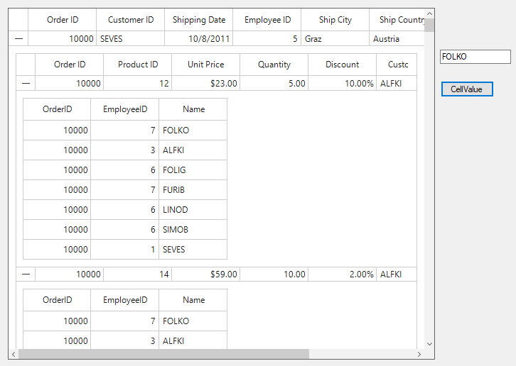
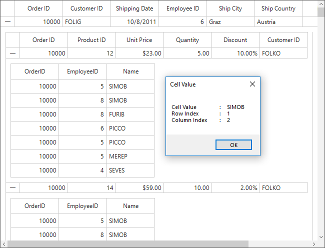

# How to Get a Cell Value in DetailsViewDataGrid in WinForms DataGrid?

This example illustrates how to get a cell value in `DetailsViewDataGrid` in [WinForms DataGrid](https://www.syncfusion.com/winforms-ui-controls/datagrid) (SfDataGrid).

## Getting the cell value by using the row column index of the cell

A particular cell value can be retrieved from records in the [SfDataGrid.View](https://help.syncfusion.com/cr/windowsforms/Syncfusion.WinForms.DataGrid.SfDataGrid.html#Syncfusion_WinForms_DataGrid_SfDataGrid_View) by using the row column index of the cell. And get the second level [DetailsViewDataGrid](https://help.syncfusion.com/cr/Syncfusion.WinForms.DataGrid.DetailsViewDataGrid.html) cell value by using the first level grid instance.

``` csharp
btnGetCellValue.Click += BtnGetCellValue_Click;
 
private void BtnGetCellValue_Click(object sender, EventArgs e)
{      
    SfDataGrid sfDataGrid = this.sfDataGrid1.GetDetailsViewGrid(2);
    SfDataGrid secondlevel = sfDataGrid.GetDetailsViewGrid(2);
    txtGetCellValue.Text = GetCellValue(secondlevel, 1, 1);
}
 
private static string GetCellValue(Syncfusion.WinForms.DataGrid.SfDataGrid dGrid, int rowIndex, int columnIndex)
{
    string cellValue;
    if (columnIndex < 0)
        return string.Empty;
    var mappingName = dGrid.Columns[columnIndex].MappingName;
    var recordIndex = dGrid.TableControl.ResolveToRecordIndex(rowIndex);
    if (recordIndex < 0)
        return string.Empty;
    if (dGrid.View.TopLevelGroup != null)
    {
        var record = dGrid.View.TopLevelGroup.DisplayElements[recordIndex];
        if (!record.IsRecords)
            return string.Empty;
        var data = (record as RecordEntry).Data;
        cellValue = (data.GetType().GetProperty(mappingName).GetValue(data, null).ToString());
    }
    else
    {
        var record1 = dGrid.View.Records.GetItemAt(recordIndex);
        cellValue = (record1.GetType().GetProperty(mappingName).GetValue(record1, null).ToString()); 
    }

    return cellValue;
}
```



## Getting the cell value by using cell click event

Get the cell value of nested level [DetailsViewDataGrid](https://help.syncfusion.com/cr/Syncfusion.WinForms.DataGrid.DetailsViewDataGrid.html) by using the [SfDataGrid.CellClick](https://help.syncfusion.com/cr/windowsforms/Syncfusion.WinForms.DataGrid.SfDataGrid.html#Syncfusion_WinForms_DataGrid_SfDataGrid_CellClick) event.

``` csharp
(this.sfDataGrid1.DetailsViewDefinitions[0] as GridViewDefinition).DataGrid.CellClick += DataGrid_CellClick;
 
(this.childGrid.DetailsViewDefinitions[0] as GridViewDefinition).DataGrid.CellClick += childGrid_CellClick;
 
private void childGrid_CellClick(object sender, CellClickEventArgs e)
{
    // Get the row index value        
    var rowIndex = e.DataRow.RowIndex;
    //Get the column index value
    var columnIndex = e.DataColumn.ColumnIndex;
    //Get the cell value            
    var cellValue = (e.OriginalSender as DetailsViewDataGrid).View.GetPropertyAccessProvider().GetValue(e.DataRow.RowData, e.DataColumn.GridColumn.MappingName);
    MessageBox.Show("Cell Value \t:    " + cellValue + "\n" + "Row Index \t:    " + rowIndex + "\n" + "Column Index \t:    " + columnIndex, "Cell Value");
}
 
private void DataGrid_CellClick(object sender, CellClickEventArgs e)
{
    // Get the row index value        
    var rowIndex = e.DataRow.RowIndex;
    //Get the column index value
    var columnIndex = e.DataColumn.ColumnIndex;
    //Get the cell value            
    var cellValue = (e.OriginalSender as DetailsViewDataGrid).View.GetPropertyAccessProvider().GetValue(e.DataRow.RowData, e.DataColumn.GridColumn.MappingName);
    MessageBox.Show("Cell Value \t:    " + cellValue + "\n" + "Row Index \t:    " + rowIndex + "\n" + "Column Index \t:    " + columnIndex, "Cell Value");           
}        
```

